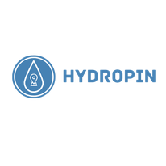
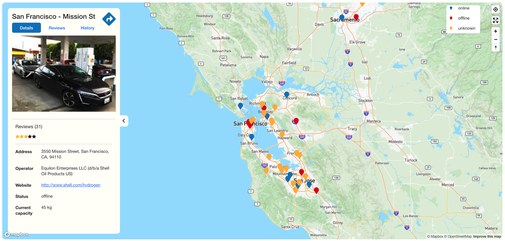
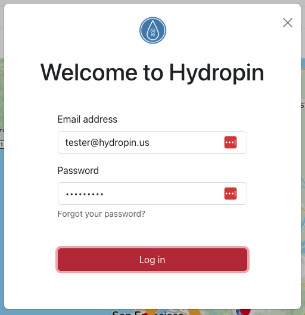
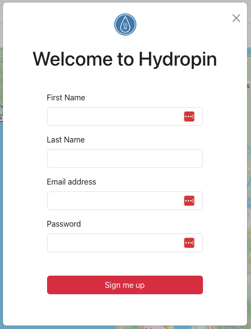
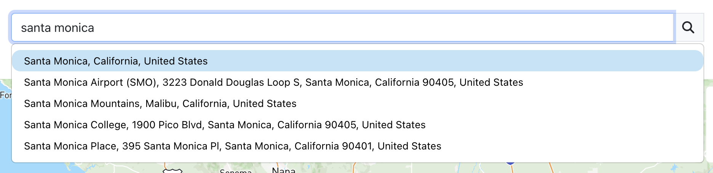

# Hydropin.us



**[Hydropin](https://hydropin.us)** is an app that help hydrogen fuel cell vehicle owner to locate and track hydrogen station status

Created with love by [Oanh Bui](https://oanhbui.com)

# Table of Contents
* [Technologies](#technologies)
* [Features](#features)
* [Installation](#install)
* [Testing & Coverage](#testing)
* [Deployment](#deployment)
* [Version 2.0](#future)
* [Author](#author)
* [License](#license)
* [Acknowledgment](#acknowledgment)


## <a name="technologies"></a>Technologies
**Hydropin** is built using these tech stack:
* Frontend: JavaScript, [React](https://react.dev/), AJAX, [Recharts](https://recharts.org/en-US/), [D3.js](https://d3js.org/), [Bootstrap](http://getbootstrap.com/), [HTML5](https://developer.mozilla.org/en-US/docs/Web/Guide/HTML/HTML5), [CSS3](https://developer.mozilla.org/en-US/docs/Web/CSS/CSS3), [Formik](https://formik.org/), [FontAwesome](https://fontawesome.com/), [MapBox](https://www.mapbox.com/), [Yup](https://github.com/jquense/yup)
* Backend: [Python](https://www.python.org/), [Flask](http://flask.pocoo.org/)
* Database: [Flask - SQLAlchemy](http://flask.pocoo.org/), [PostgreSQL](http://www.postgresql.org/)
* API: [Mapbox](https://www.mapbox.com/), [GoogleMap](https://maps.google.com), [News](https://newsapi.org/)


## <a name="features"></a>Features
[](https://www.youtube.com/watch?v=ueo4QJQSlSU)

#### Display hydrogen stations color by status


Hydrogen stations are display on the map by their's status. Red mean offline or unavailable, Blue mean available, Yellow is limited. This allowed user to quickly view and decide where to go.

#### Login - SignUp


Sign up / Login only required if user want to write a review for their favorite station. Flash session and cookies is used to store logged in user info. 

To protect user's password I use `werkzeug.security` package which internally use `pbkdf2` algorithm to generate password with salt.


#### Address autocomplete


To help user input their address I use mapbox's autocomplete api to suggest address based on prefix. Here I also use debounce technic to reduce unnecessary api call


## <a name="install"></a>Installation
To run this project on local please follow these steps.

(Docker compose is coming soon...)

#### Prerequisite
Install PosgreSQL (MacOS) with **homebrew**

``` brew install postgresql@15 ```

#### Set up
Clone this repository.
```
$ git clone https://github.com/oanhbui/hydropin.git
```

Create a virtual environment for the project.
```
python3 -m venv venv
```

Activate the virtual environment.
```
source ./venv/bin/activate
```

Install dependencies.
```
$ pip install -r requirements.txt
```

Run PostgreSQL (see the elephant icon active).

Create database with the name "trips" (do it once).
```
$ psql hydropin

$ dropdb hydropin

$ createdb hydropin
```

Install front end requirement
```
$ cd ui
$ npm install
```

To run back end from command line run
```
$ cd backend
$ python server.py
```

To run fron end from command line run
```
$ cd ui
$ npm start
```

## <a name="testing"></a>Testing
Front end testing will be run with `jest`. For back test will be run with `pytest`

## <a name="deployment"></a>Deployment

TODO

## <a name="future"></a>Version 2.0
Future features to come:

- [ ] Avatar upload
- [ ] More testing

## <a name="author"></a>Author

**Oanh Bui** (Github: [oanhbui](https://github.com/oanhbui)) (Portfolio: [oanhbui.com](https://oanhbui.com))

## <a name="license"></a>License

This project is licensed under the MIT License. See the [LICENSE.txt](LICENSE.txt) file for details.

## <a name="acknowledgments"></a>Acknowledgments
* Thanks to Hackbright Accademy guidance and support
